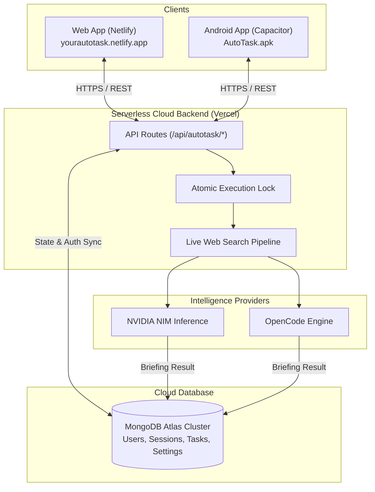

<div align="center">


# AutoTask

**Autonomous AI Calendar Agent & Scheduled Research Briefings**

<sub>Powered by NVIDIA NIM Cloud & OpenCode AI with real-time web search and cross-platform MongoDB synchronization.</sub>

<br>

[](https://react.dev)
[](https://www.typescriptlang.org)
[](https://capacitorjs.com)
[](https://cloud.mongodb.com)
[](https://build.nvidia.com)
[](https://yourautotask.netlify.app)

<br>

<a href="https://yourautotask.netlify.app">
  
</a>
&nbsp;
<a href="AutoTask.apk">
  
</a>

</div>

---

## ⚡ Overview

**AutoTask** is an autonomous AI calendar intelligence platform that bridges time management and real-time deep research. Instead of static calendar reminders, AutoTask proactively researches, analyzes, and synthesizes scheduled tasks ahead of time, delivering complete, high-signal intelligence briefings the exact moment they are due.

Whether accessed via your desktop browser or native Android mobile device, all task schedules, research outputs, and API credentials stay continuously synchronized in real-time through **MongoDB Atlas**.

---

## ✨ Key Features

- 📅 **Autonomous Calendar Workspace**  
  Schedule one-time or recurring daily research briefings with an interactive calendar view, timeline agenda, and priority task boards.

- 🧠 **Dual AI Engine Support**  
  - **NVIDIA NIM Cloud**: Access high-performance inference across `meta/llama-3.1-70b-instruct`, `meta/llama-3.2-11b-vision-instruct`, `nvidia/llama-3.1-nemotron-70b-instruct`, and `mistralai/mistral-large-2-instruct`.
  - **OpenCode AI Harness**: Seamless fallback and local CLI or API execution for autonomous developers.

- 🌐 **Real-Time Live Web Intelligence**  
  Autonomous search pipeline discovers and validates live web data feeds before synthesizing the final briefing, citing sources and references.

- 🔒 **Distributed Single-Flight Execution Lock**  
  Intelligent atomic claiming via MongoDB guarantees that when a task is scheduled, only one device runs the research pipeline. If both desktop and mobile apps are open, they share the single authoritative response from MongoDB—preventing duplicate AI tokens or conflicting outputs.

- ☁️ **Cloud Account & Cross-Device Sync**  
  Secure authentication with scrypt encryption. Accounts, schedules, task histories, and NVIDIA API keys sync across Web and Android APK without manual re-entry.

- 📱 **Native Android Experience (Capacitor)**  
  Standalone signed Android release APK with native notifications, custom monochrome launcher icons, and edge-to-edge mobile UI design.

- 🔔 **Chime & Native Notifications**  
  Delivers subtle audio cues via Web Audio API alongside native mobile and browser push notifications when tasks are ready and delivered.

---

## 🏗️ Architecture



---

## 🚀 Quick Start

### 1. Prerequisites
- **Node.js**: v20 or higher
- **pnpm**: `corepack enable && corepack prepare pnpm@latest --activate`
- **MongoDB**: MongoDB Atlas connection URI or local instance

### 2. Clone & Install
```bash
git clone https://github.com/vikasvkori1290/autotask.git
cd autotask
pnpm install
```

### 3. Environment Setup
Create a `.env` file in the root directory:
```env
MONGODB_URI=mongodb+srv://<username>:<password>@<cluster>.mongodb.net/autotask
VITE_AUTOTASK_SERVER_URL=https://autotask-mocha.vercel.app
```

### 4. Run Development Server
```bash
pnpm dev
```
Open [http://localhost:5199](http://localhost:5199) in your browser.

---

## 📱 Building the Android APK

AutoTask is configured with Capacitor for native Android deployment:

1. **Build Production Web Bundle:**
   ```bash
   pnpm vite build
   ```

2. **Sync Web Assets to Android Project:**
   ```bash
   npx cap sync android
   ```

3. **Assemble Release APK:**
   ```bash
   cd android
   ./gradlew assembleRelease
   ```
   The signed release APK will be located at:
   `android/app/build/outputs/apk/release/app-release.apk` (and copied to `AutoTask.apk`).

---

## 🔐 MongoDB Atlas Configuration

To enable cloud synchronization between web and mobile devices:
1. Open your **[MongoDB Atlas Dashboard](https://cloud.mongodb.com/)**.
2. Navigate to **Security → Network Access**.
3. Click **Add IP Address** and select **Allow Access from Anywhere (`0.0.0.0/0`)**.
4. Set your connection string as `MONGODB_URI` in your Vercel/Netlify environment variables.

---

## 📄 License

Licensed under the [Apache-2.0 License](LICENSE).
