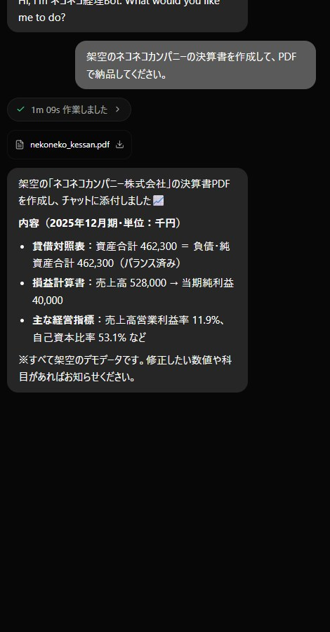
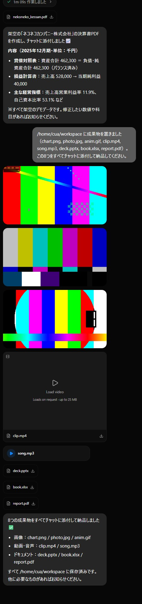
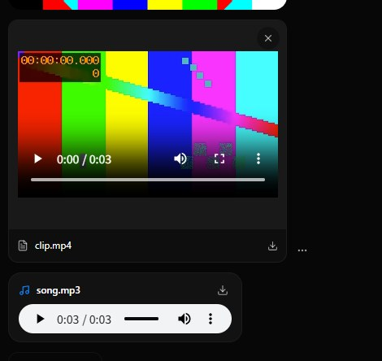
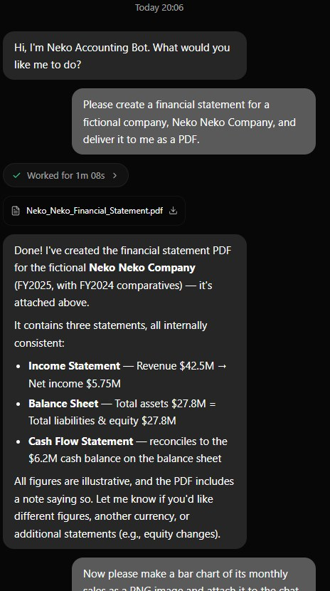
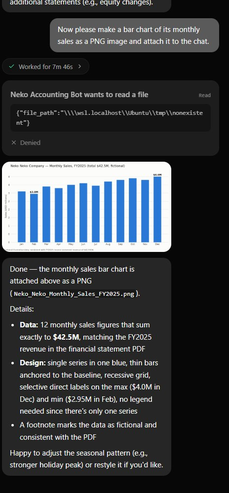
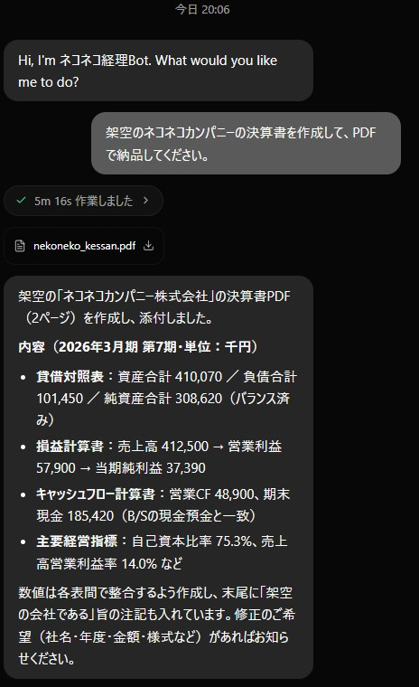
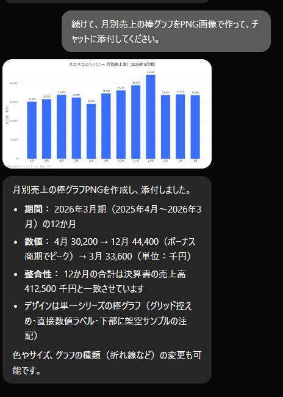

# A bot makes a file in its VM and attaches it to the chat

## Integration verification — 2026-09-26

Updated against main `f2e450726`. The MCP definitions and handlers now live
in the existing catalog/call modules; the proxy remains unchanged. File
attachments coexist with voice notes, including in rooms. VM commands and
exports use the existing computer gate: lazy Auto claims work, and person
takeover, expired leases and ended turns refuse access.

Verified in disposable homes, without customer data or a real provider:

- Attachment, command, proxy, message-file and gallery suites: 234 tests passed.
- Catalog source/bundle goldens, VM claim/lease, prompt, gallery and command
  regressions: 98 tests passed (some overlap with the previous group).
- Real-server attachment routes: 3 tests passed, including message-only
  authorization, parallel per-turn limits, and private image delivery.
- Real-server VM routing: all 31 tests passed. New cases attach and download
  a room speaker's PDF, reject commands/exports after takeover or lease
  expiry, revoke stopped turns, and claim Auto on the first shell call.
- Lint, locale validation, production build/typecheck and packaged-server
  smoke passed.

The VM routing suite replaces only the container boundary; it does not prove
Docker/Podman execution or live-model behavior. The real-VM evidence below is
the original contributor's September 19 run, not a new acceptance run.
Cloud/VPS file transfer and mobile file rendering are outside this change.

Captured on 2026-09-19 against upstream `main` (v0.1.84) with a real Claude Code CLI
(2.1.251) running Z.ai `glm-5.3`, a per-bot Podman Local VM desktop, and the
production build served by the real `server/index.ts` (`OMB_STATIC_DIR`) on a
disposable data directory. Every assistant message in the session transcript records
`glm-5.3`.

## What was wrong

A bot working in its own Local VM had two problems:

1. **It could not hand over its work.** The only way to put a file in the chat was a
   Markdown link, and a link to `/home/cua/workspace/...` cannot be opened by the
   server (the VM home is a bind mount outside every allowed root). The chat showed
   nothing usable. See #1548.
2. **It could only run commands by typing into a terminal window and reading
   screenshots.** Cua Driver exposes no shell tool, so a first real run took about 9
   minutes and then reported success although the PDF did not exist.

## What this adds

- **`attach_file`** (agents MCP). The bot passes a path: a VM path such as
  `/home/cua/workspace/report.pdf`, a path relative to its VM workspace, or a file in
  its working folder. The server opens it with the same hardened resolver the
  message-file route already uses, copies it into the private attachment store, and
  posts it as the bot's own message. Images become `image` attachments; everything
  else is a `file` attachment served only through the message that carries it.
- **`vm_exec`** (agents MCP). Runs one shell command in the bot's own Local VM (as the
  desktop user, in `/home/cua/workspace`) and returns the exit code, stdout and stderr
  as text. The time limit (default 60 s, at most 300 s) is enforced inside the
  container with `timeout`, so a runaway process is really stopped.
- **Inline audio.** mp3, m4a, aac, wav, ogg, opus and flac play from a play button,
  loaded on request like the existing video card.
- **A simpler attachment look.** No bubble around a message that is only files, no
  framed "Attachments N" box, no storage-id caption under an image, and images keep
  their own shape.
- The attachment store now accepts mp4, webm and mov (three lines at the top of
  `FILE_MIMES`), so a bot can attach a video. Limits: 25 MB (images 10 MB), 10
  attachments per turn, and refusals that name the supported types.

Documents (pdf, xlsx, pptx) appear as download chips on `main`; in-chat previews for
them come with #959 and need nothing further from this change.

## The original request, done by the bot

Request, word for word: *"架空のネコネコカンパニーの決算書を作成して、PDFで納品してください。"*
No extra instructions. The bot finished in about 70 seconds with four tool calls, no
approval card and no screenshots: `vm_exec` (check for reportlab), `vm_exec`
(`pip install --user reportlab`), `vm_exec` (write and run the script; a 5,844-byte
PDF), then `attach_file`. The file exists under the VM home, the thread holds one
`application/pdf` attachment authored by the bot, and fetching it through the
message-scoped route returns the complete file (`%PDF-1.4` … `%%EOF`, 5,844 bytes,
`attachment; filename="nekoneko_kessan.pdf"`). Nothing was staged.

## Eight file types

The files were staged in the VM workspace by the test, not made by the bot: png, jpg
and gif from `ffmpeg` test sources, a 3 second 440 Hz mp3, an mp4, and pdf, xlsx and
pptx fixtures. The bot was told the names and asked to attach them. **The bot's part is
real**: GLM-5.3 called `attach_file` for each and the server copied each out of the VM.

| Check | Result |
| --- | --- |
| Stored on the thread | image/png, image/jpeg, image/gif, video/mp4, audio/mpeg, pptx, xlsx, pdf |
| Audio (click play) | loaded through the authorized route, `currentTime` advanced to 2.23 s of 3 s |
| Video (click load) | loaded as a blob, controls shown, duration 3 s |
| Browser console | no errors in any capture |

## The same request in English and in Japanese (final build)

Re-run after the review fixes, with the build that carries them: the real Claude Code CLI
on Z.ai `glm-5.3`, one Local VM desktop per bot, the UI language set to match each
conversation. Nothing was staged: each bot made its own files with `vm_exec` and attached
them with `attach_file`. Every attachment was then fetched through the message-scoped
route and checked.

| Conversation | Request | Result |
| --- | --- | --- |
| English (English UI, bot told to answer in English) | "Please create a financial statement for a fictional company, Neko Neko Company, and deliver it to me as a PDF." then "Now please make a bar chart of its monthly sales as a PNG image and attach it to the chat." | PDF 5,357 bytes (`%PDF-` ... `%%EOF`), PNG 53,024 bytes, both `200` |
| Japanese (Japanese UI, bot told to answer in Japanese) | "架空のネコネコカンパニーの決算書を作成して、PDFで納品してください。" then "続けて、月別売上の棒グラフをPNG画像で作って、チャットに添付してください。" | PDF 43,243 bytes (`%PDF-` ... `%%EOF`), PNG 59,454 bytes, both `200` |

English, PDF then PNG:

Japanese, PDF then PNG:

What happened that is not a clean pass:

- **One approval card in the English run.** While starting the chart the model tried to
  `Read` a non-existent path (`\\wsl.localhost\Ubuntu\tmp\nonexistent`) to load
  "dataviz guidance". It is a host file tool, unrelated to `attach_file` and `vm_exec`. I
  denied it (visible in the screenshot) and the bot finished the chart. The Japanese run
  raised no card at all.
- **An earlier English run, before one sentence was added to the VM prompt,** stopped at an
  approval card because the model wrote its script with the host `Write` tool, which cannot
  reach the VM. After denying it the bot switched to the VM and finished. The prompt now
  also says to create files with `vm_exec` and that the host file tools cannot reach the
  VM; the English PDF above ran without a card. That is one sample, not a guarantee.
- Wall-clock times are not a benchmark: the two bots ran at the same time, and the English
  chart turn includes the time the card waited for me (about 7 minutes). The Japanese PDF
  turn took 5 minutes 16 seconds this time (about 70 seconds in the first run).
- On this branch a PDF appears as a save chip; the in-chat preview comes with #959.

## A clip the browser cannot decode

A 34-byte `broken.mp3` (not audio) was attached by the real bot, then played from the chat.
The server hands it out as `audio/mpeg`, so the failure happens in the browser's decoder.

| | Play button after the error | Retry possible |
| --- | --- | --- |
| Before the fix | gone (only a note icon and the download link remain) | no |
| After the fix | back | yes (a second click loads it again and shows the same message) |

Before:

After:

## Found only by running it for real

- The first run returned "No file was found" for every file even though the VM could
  see them: the `agents` capability carries no VM target, so the tool must read the
  thread's claimed desktop (`localVmThreadTargets`). The test-only capability endpoint
  cannot provision a VM, so no automated test could catch it.
- A tool description that said "check the file exists first" sent the model to the
  host Bash with a VM path, which raised approval cards. The description and VM prompt
  now say `attach_file` reports a missing file itself.
- Even then GLM spent minutes driving a terminal window through screenshots, because
  the VM had no way to run a command and read text. `vm_exec` removed that.

## Not covered

- Only the Local VM path was run end to end. Cloud boat and VPS computers were not;
  `vm_exec` is Local VM only.
- The group/room view got the same "no bubble for attachment-only messages" change; it
  was type- and test-checked but not looked at in a real room.
- One earlier run of the Z.ai path ended mid-turn with `claude exited 1 ...
  unrecognized_model` (a "continue" message resumed it). It did not recur in the final
  runs and is not caused by this change.

## Tests

`server/bot-attachment.test.ts` (path mapping, every supported type, refusals),
`server/container-exec.test.ts` (command line, exit codes, time limit, clipping),
`server/index.test.ts` (attach, serve only through the message, refusals, per-turn cap,
no VM), `server/drivers/agents-proxy.test.ts` (tool list, request bodies, failure
wording), and `src/components/AttachmentGallery.test.ts` (bot attachments become private
files, audio loading, MIME and size limits).
